# MathFmt

[](https://github.com/raydog/mathfmt/actions/workflows/ci.yml)

A tiny ASCIIMath renderer. Outputs directly to MathML, as the majority of
browsers support it to varying degrees.

- Fast! Runs around 4-6x faster than ASCIIMathML (the main project) and around
  20x faster than MathJax.
- Tiny! The full library is around 15 KiB minimized, and has no external runtime
  dependencies.
- Supports the entire ASCIIMath syntax, along with some extensions and bugfixes.
- Compatible with server-side rendering: Unlike the official repo, we assemble
  HTML strings directly instead of leaning on browser-only HTML entity objects. This means that this
  library can be trivially embedded in contexts (such as Vue components) that
  might be called either in a browser, or in a Node.js server.

## Usage

The library is available from NPM:

```sh
npm install mathfmt
```

Pre-built libraries are also available from the [releases](https://github.com/raydog/mathfmt/releases) page.

This library provides an `intoMathML` function, that parses ASCIIMath, and produces a MathML string.

```ts
// CommonJS
const { intoMathML } = require("mathfmt");

// ES Modules
import { intoMathML } from "mathfmt";

const result = intoMathML("sum_{i=0}^oo");
```

The intoMathML function also accepts a second option argument with these attributes:

| Option   | Default | Description                                                                                                                                                                                                                                                                                |
| -------- | ------- | ------------------------------------------------------------------------------------------------------------------------------------------------------------------------------------------------------------------------------------------------------------------------------------------ |
| `id`     | --      | An id string, that will be attached to the root `<math>` element in the result.                                                                                                                                                                                                            |
| `class`  | --      | A class name, that will be attached to the root `<math>` element in the result.                                                                                                                                                                                                            |
| `style`  | --      | A CSS style string, that will be attached to the root `<math>` element in the result. This value will be HTML-escaped, but then placed verbatim in the output. If any of the CSS values themselves are from untrusted sources, be sure to escape them.                                     |
| `inline` | false   | Set this to true if the resulting MathML is expected to be inlined with normal text. In that case, the MathML renderer will attempt to draw certain figures in a more vertically-compact manner. The default is `false`, to draw figures in a taller (and more visually appealing) manner. |

Example:

```ts
intoMathML("x = (-b +- sqrt(b^2-4ac)) / (2a)", {
  id: "fig-123",
  class: "math-formula",
  inline: false,
});
// => '<math id="fig-123" class="math-formula" display="block"><mi>x</mi><mo>=</mo> ...'
```

## ASCIIMath Syntax

ASCIIMath is a simple format: it is parsed left to right without any real
operator precedence. It will simply look for 'symbols', which are short strings
with special significance. (For example, typing 'beta' will put a 'β' symbol in
the output.) If a symbol can't be found at the current place in the source text,
the current character is treated as as simple single-character identifier, and
we move on.

A few characters have special significance:

- `_` will add a subscript. (eg:`beta_0` will output )
- `^` will add a superscript. (eg: `x^3` will output 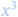)
- `/` will add a fraction. (eg: `a/b` will output )

Most of the language will simply work like that - running from left-to-right,
assembling a Math string from the symbols encountered. If you want to group
some of those symbols together (eg: you want alpha to the power of x + 1) you
can use parentheses / braces to group symbols. For example, `alpha^(x + 1)` will
result in: 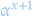.
ASCIIMath supports a wide range of brace types - you can read more about those
below.

Some symbols come with special formatting rules. For example, `sqrt` is a
'unary' symbol, which will draw a square-root bar around the symbol /
parenthesized group that follows it. For example: `sqrt (x^2 + y^2)` results in:
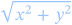
There are a large number of unaries available, described below. There are also a
few 'binary' symbols, which apply some effect to the next TWO symbols / groups.
Those are also described below.

Literal strings and numbers can also be included. Strings (aka: text blocks)
are surrounded by double quote characters, like: `"text here"`. If you want
double quotes within that string, put two double quotes in a row: `""`. Literal
numbers can be included as well, and will look like: `123` or `12.34`.

All of these rules can be combined together to create complex formulas:

<figure style="text-align: center">
  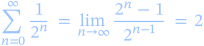
  <figcaption><code>sum_(n=0)^oo 1/2^n = lim_(n->oo)(2^n-1)/2^(n-1) = 2</code></figcaption>
</figure>

## Symbols

### Greek Letters

Most greek letters can be simply referenced by name. A few extra mathematically
significant variations of these symbols are also available.

| Upper Case                                | Lower case                                | Variant                    |
| ----------------------------------------- | ----------------------------------------- | -------------------------- |
| Α: <code>Alpha</code>                     | α: <code>alpha</code>                     |
| Β: <code>Beta</code>                      | β: <code>beta</code>                      |
| Γ: <code>Gamma</code>                     | γ: <code>gamma</code>                     |
| Δ: <code>Delta</code>                     | δ: <code>delta</code>                     |
| Ε: <code>Epsilon</code>                   | ε: <code>epsilon</code> <code>epsi</code> | ɛ: <code>varepsilon</code> |
| Ζ: <code>Zeta</code>                      | ζ: <code>zeta</code>                      |
| Η: <code>Eta</code>                       | η: <code>eta</code>                       |
| Θ: <code>Theta</code>                     | θ: <code>theta</code>                     | ϑ: <code>vartheta</code>   |
| Ι: <code>Iota</code>                      | ι: <code>iota</code>                      |
| Κ: <code>Kappa</code>                     | κ: <code>kappa</code>                     |
| Λ: <code>Lambda</code> <code>Lamda</code> | λ: <code>lambda</code> <code>lamda</code> |
| Μ: <code>Mu</code>                        | μ: <code>mu</code>                        |
| Ν: <code>Nu</code>                        | ν: <code>nu</code>                        |
| Ξ: <code>Xi</code>                        | ξ: <code>xi</code>                        |
| Ο: <code>Omicron</code>                   | ο: <code>omicron</code>                   |
| Π: <code>Pi</code>                        | π: <code>pi</code>                        | ϖ: <code>varpi</code>      |
| Ρ: <code>Rho</code>                       | ρ: <code>rho</code>                       | ϱ: <code>varrho</code>     |
| Σ: <code>Sigma</code>                     | σ: <code>sigma</code>                     | ς: <code>varsigma</code>   |
| Τ: <code>Tau</code>                       | τ: <code>tau</code>                       |
| Υ: <code>Upsilon</code>                   | υ: <code>upsilon</code>                   |
| Φ: <code>Phi</code>                       | ϕ: <code>phi</code>                       | φ: <code>varphi</code>     |
| Χ: <code>Chi</code>                       | χ: <code>chi</code>                       |
| Ψ: <code>Psi</code>                       | ψ: <code>psi</code>                       |
| Ω: <code>Omega</code>                     | ω: <code>omega</code>                     |

### Other Math Identifiers

| Symbols                               | Output |
| ------------------------------------- | ------ |
| <code>CC</code>                       | ℂ      |
| <code>hbar</code>                     | ℏ      |
| <code>NN</code>                       | ℕ      |
| <code>QQ</code>                       | ℚ      |
| <code>RR</code>                       | ℝ      |
| <code>ZZ</code>                       | ℤ      |
| <code>aleph</code>                    | ℵ      |
| <code>O/</code> <code>emptyset</code> | ∅      |
| <code>oo</code> <code>infty</code>    | ∞      |

### Standard Functions and Other Identifiers

ASCIIMath knows about a number of basic identifiers and functions, and will
describe these symbols to MathML in a way that is appropriate. For example,
identifiers like 'dx' will be presented to MathML as a single identifier, while
functions like 'sin' or 'tan' will be rendered as operators, and will have some
special spacing + grouping rules applied with their arguments.

#### Identifiers

<code>dt</code> <code>dx</code> <code>dy</code> <code>dz</code>

#### Standard Functions

<code>arccos</code> <code>Arccos</code> <code>arccot</code> <code>arccsc</code>
<code>arcsec</code> <code>arcsin</code> <code>Arcsin</code> <code>arctan</code>
<code>Arctan</code> <code>cos</code> <code>Cos</code> <code>cosh</code>
<code>Cosh</code> <code>cot</code> <code>Cot</code> <code>coth</code>
<code>csc</code> <code>Csc</code> <code>csch</code> <code>det</code>
<code>dim</code> <code>exp</code> <code>gcd</code> <code>glb</code>
<code>ker</code> <code>lcm</code> <code>ln</code> <code>Ln</code>
<code>log</code> <code>Log</code> <code>lub</code> <code>mod</code>
<code>sec</code> <code>Sec</code> <code>sech</code> <code>sin</code>
<code>Sin</code> <code>sinh</code> <code>Sinh</code> <code>tan</code>
<code>Tan</code> <code>tanh</code> <code>Tanh</code>

### Basic Op symbols

A large number of basic op symbols are available.

| Symbols                                                                               | Output |
| ------------------------------------------------------------------------------------- | ------ |
| <code>+</code>                                                                        | +      |
| <code>,</code>                                                                        | ,      |
| <code>-</code>                                                                        | -      |
| <code>/</code>                                                                        | /      |
| <code>:&mid;:</code>                                                                  | &mid;  |
| <code>&lt;</code> <code>lt</code>                                                     | &lt;   |
| <code>=</code>                                                                        | =      |
| <code>&gt;</code> <code>gt</code>                                                     | &gt;   |
| <code>^</code>                                                                        | ^      |
| <code>\_</code>                                                                       | \_     |
| <code>and</code>                                                                      | and    |
| <code>if</code>                                                                       | if     |
| <code>or</code>                                                                       | or     |
| <code>neg</code> <code>not</code>                                                     | ¬      |
| <code>+-</code> <code>pm</code>                                                       | ±      |
| <code>xx</code> <code>times</code>                                                    | ×      |
| <code>-:</code> <code>div</code> <code>divide</code>                                  | ÷      |
| <code>dag</code> <code>dagger</code>                                                  | †      |
| <code>ddag</code> <code>ddagger</code>                                                | ‡      |
| <code>...</code> <code>ldots</code>                                                   | …      |
| <code>&apos;</code> <code>prime</code>                                                | ′      |
| <code>&lt;-</code> <code>larr</code> <code>leftarrow</code>                           | ←      |
| <code>uarr</code> <code>uparrow</code>                                                | ↑      |
| <code>-&gt;</code> <code>to</code> <code>rarr</code> <code>rightarrow</code>          | →      |
| <code>darr</code> <code>downarrow</code>                                              | ↓      |
| <code>&lt;-&gt;</code> <code>harr</code> <code>leftrightarrow</code>                  | ↔      |
| <code>-&gt;&gt;</code> <code>twoheadrightarrow</code>                                 | ↠      |
| <code>&gt;-&gt;</code> <code>rightarrowtail</code>                                    | ↣      |
| <code>&mid;-&gt;</code> <code>mapsto</code>                                           | ↦      |
| <code>rightleftharpoons</code>                                                        | ⇌      |
| <code>lArr</code> <code>Leftarrow</code>                                              | ⇐      |
| <code>rArr</code> <code>implies</code> <code>Rightarrow</code>                        | ⇒      |
| <code>dArr</code> <code>Downarrow</code>                                              | ⇓      |
| <code>&lt;=&gt;</code> <code>iff</code> <code>hArr</code> <code>Leftrightarrow</code> | ⇔      |
| <code>AA</code> <code>forall</code>                                                   | ∀      |
| <code>del</code> <code>partial</code>                                                 | ∂      |
| <code>EE</code> <code>exists</code>                                                   | ∃      |
| <code>grad</code> <code>nabla</code>                                                  | ∇      |
| <code>in</code>                                                                       | ∈      |
| <code>!in</code> <code>notin</code>                                                   | ∉      |
| <code>//</code>                                                                       | ∕      |
| <code>&bsol;&bsol;</code> <code>setminus</code> <code>backslash</code>                | ∖      |
| <code>\*\*</code> <code>ast</code>                                                    | ∗      |
| <code>@</code> <code>circ</code>                                                      | ∘      |
| <code>prop</code> <code>propto</code>                                                 | ∝      |
| <code>/\_</code> <code>angle</code>                                                   | ∠      |
| <code>^^</code> <code>wedge</code>                                                    | ∧      |
| <code>vv</code> <code>vee</code>                                                      | ∨      |
| <code>nn</code> <code>cap</code>                                                      | ∩      |
| <code>uu</code> <code>cup</code>                                                      | ∪      |
| <code>:.</code> <code>therefore</code>                                                | ∴      |
| <code>:&apos;</code> <code>because</code>                                             | ∵      |
| <code>~</code> <code>sim</code>                                                       | ∼      |
| <code>~=</code> <code>cong</code>                                                     | ≅      |
| <code>~~</code> <code>approx</code>                                                   | ≈      |
| <code>!=</code> <code>ne</code>                                                       | ≠      |
| <code>-=</code> <code>equiv</code>                                                    | ≡      |
| <code>!-=</code> <code>notequiv</code>                                                | ≢      |
| <code>&lt;=</code> <code>le</code>                                                    | ≤      |
| <code>&gt;=</code> <code>ge</code>                                                    | ≥      |
| <code>ll</code> <code>mlt</code>                                                      | ≪      |
| <code>gg</code> <code>mgt</code>                                                      | ≫      |
| <code>-&lt;</code> <code>prec</code>                                                  | ≺      |
| <code>&gt;-</code> <code>succ</code>                                                  | ≻      |
| <code>sub</code> <code>subset</code>                                                  | ⊂      |
| <code>sup</code> <code>supset</code>                                                  | ⊃      |
| <code>!sub</code> <code>notsubset</code>                                              | ⊄      |
| <code>!sup</code> <code>notsupset</code>                                              | ⊅      |
| <code>sube</code> <code>subseteq</code>                                               | ⊆      |
| <code>supe</code> <code>supseteq</code>                                               | ⊇      |
| <code>!sube</code> <code>notsubseteq</code>                                           | ⊈      |
| <code>!supe</code> <code>notsupseteq</code>                                           | ⊉      |
| <code>o+</code> <code>oplus</code>                                                    | ⊕      |
| <code>o-</code> <code>ominus</code>                                                   | ⊖      |
| <code>ox</code> <code>otimes</code>                                                   | ⊗      |
| <code>o.</code> <code>odot</code>                                                     | ⊙      |
| <code>&mid;--</code> <code>vdash</code>                                               | ⊢      |
| <code>TT</code> <code>top</code>                                                      | ⊤      |
| <code>_&mid;_</code> <code>bot</code>                                                 | ⊥      |
| <code>&mid;==</code> <code>models</code>                                              | ⊨      |
| <code>diamond</code>                                                                  | ⋄      |
| <code>\*</code> <code>cdot</code>                                                     | ⋅      |
| <code>\*\*\*</code> <code>star</code>                                                 | ⋆      |
| <code>&mid;&gt;&lt;&mid;</code> <code>bowtie</code>                                   | ⋈      |
| <code>&mid;&gt;&lt;</code> <code>ltimes</code>                                        | ⋉      |
| <code>&gt;&lt;&mid;</code> <code>rtimes</code>                                        | ⋊      |
| <code>vdots</code>                                                                    | ⋮      |
| <code>cdots</code>                                                                    | ⋯      |
| <code>ddots</code>                                                                    | ⋱      |
| <code>&mid;~</code> <code>lceiling</code>                                             | ⌈      |
| <code>~&mid;</code> <code>rceiling</code>                                             | ⌉      |
| <code>&mid;\_\_</code> <code>lfloor</code>                                            | ⌊      |
| <code>\_\_&mid;</code> <code>rfloor</code>                                            | ⌋      |
| <code>frown</code>                                                                    | ⌢      |
| <code>square</code>                                                                   | □      |
| <code>/\_&bsol;</code> <code>triangle</code>                                          | △      |
| <code>&gt;-&gt;&gt;</code> <code>twoheadrightarrowtail</code>                         | ⤖      |
| <code>-&lt;=</code> <code>preceq</code>                                               | ⪯      |
| <code>&gt;-=</code> <code>succeq</code>                                               | ⪰      |

### Parenthesis and Other Braces

A number of different braces are supported, and can be (with one exception)
freely mix-and-matched, just so long as left braces are paired with right
braces.

The brace symbols are usually visible, but can sometimes be made invisible due
to certain features of the formula's structure. For example:

<figure style="text-align: center">
  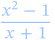
  <figcaption><code>{x^2-1}/{x+1}</code></figcaption>
</figure>

If you want to keep those braces in the output, add another set of braces around
each section - the outside ones will be hidden, the inside ones will be shown.

If you _WANT_ the braces to be hidden in a situation where they'd normally be
shown, use the `{:` and `:}` braces - they'll be invisible in the output.

| Left Brace Symbols                                        | Right Brace Symbols                                       | Output          |
| --------------------------------------------------------- | --------------------------------------------------------- | --------------- |
| <code>(</code> <code>left(</code>                         | <code>)</code> <code>right)</code>                        | ( ... )         |
| <code>[</code> <code>left[</code>                         | <code>]</code> <code>right]</code>                        | [ ... ]         |
| <code>{</code>                                            | <code>}</code>                                            | { ... }         |
| <code>(:</code> <code>&lt;&lt;</code> <code>langle</code> | <code>:)</code> <code>&gt;&gt;</code> <code>rangle</code> | ⟨ ... ⟩         |
| <code>&mid;:</code>                                       | <code>:&mid;</code>                                       | &mid; ... &mid; |
| <code>{:</code>                                           | <code>:}</code>                                           | ...             |

Additionally, `|` braces without the `:` bits are also supported, but hey differ
from the other braces, and they cannot be mix-and-matched with other braces.
They MUST be paired with another `|` brace.

| Left Brace Symbols | Right Brace Symbols | Output          |
| ------------------ | ------------------- | --------------- |
| <code>&mid;</code> | <code>&mid;</code>  | &mid; ... &mid; |

### "Stacked" Operator Symbols

A stacked symbol will render the superscript and subscripts above and below the
operator, which looks pretty neat.

| Symbols                                | Example                      | Output                                     |
| -------------------------------------- | ---------------------------- | ------------------------------------------ |
| <code>lim</code>                       | <code>lim\_{x-&gt;oo}</code> |            |
| <code>Lim</code>                       | <code>Lim\_{x-&gt;oo}</code> |            |
| <code>max</code>                       | <code>max_x</code>           |            |
| <code>min</code>                       | <code>min_x</code>           | 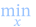           |
| <code>prod</code>                      | <code>prod\_{i=0}^n</code>   | 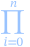         |
| <code>sum</code>                       | <code>sum\_{i=0}^n</code>    | 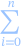           |
| <code>^^^</code> <code>bigwedge</code> | <code>^^^\_{i=0}^n</code>    |  |
| <code>vvv</code> <code>bigvee</code>   | <code>vvv\_{i=0}^n</code>    | 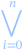     |
| <code>nnn</code> <code>bigcap</code>   | <code>nnn\_{i=0}^n</code>    | 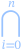     |
| <code>uuu</code> <code>bigcup</code>   | <code>uuu\_{i=0}^n</code>    | 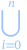     |

### "Stretchy" Operator Symbols

A few other symbols are "stretchy" - in that, they'll stretch to match the
height of the formula next to it.

| Symbols           | Example              | Output                             |
| ----------------- | -------------------- | ---------------------------------- |
| <code>int</code>  | <code>int_0^n</code> | 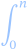   |
| <code>oint</code> | <code>oint_C</code>  |  |

### Unary Symbols

A unary is a symbol that will apply some sort of effect to the symbol / term
immediately after it, which is called the 'argument'.

| Unary Symbols                               | Example                                                   | Output                                         |
| ------------------------------------------- | --------------------------------------------------------- | ---------------------------------------------- |
| <code>abs</code> <code>Abs</code>           | <code>abs x</code>                                        |                |
| <code>bar</code> <code>overline</code>      | <code>bar x</code>                                        |      |
| <code>cancel</code>                         | <code>cancel x</code>                                     |          |
| <code>ceil</code>                           | <code>ceil x</code>                                       |              |
| <code>ddot</code>                           | <code>ddot x</code>                                       | 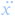             |
| <code>dot</code>                            | <code>dot x</code>                                        |                |
| <code>floor</code>                          | <code>floor x</code>                                      |            |
| <code>hat</code>                            | <code>hat x</code>                                        |                |
| <code>norm</code>                           | <code>norm x</code>                                       | 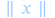             |
| <code>obrace</code> <code>overbrace</code>  | <code>obrace (m\*x + b)^&quot;linear&quot;</code>         | 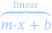   |
| <code>overarc</code> <code>overparen</code> | <code>overarc x</code>                                    |    |
| <code>sqrt</code>                           | <code>sqrt x</code>                                       |              |
| <code>mbox</code> <code>text</code>         | <code>text(Hello &quot;World&quot;)</code>                |              |
| <code>tilde</code>                          | <code>tilde x</code>                                      | 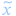           |
| <code>ubrace</code> <code>underbrace</code> | <code>ubrace (x^2 - 2x + 1)\_&quot;quadratic&quot;</code> | 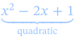 |
| <code>ul</code> <code>underline</code>      | <code>ul x</code>                                         |    |
| <code>vec</code>                            | <code>vec x</code>                                        | 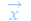               |

Note: `cancel` depends on the non-standard &lt;menclose&gt; tag. Support between
browsers varies.

### Binary Symbols

A binary is a symbol that will apply some sort of special layout action using
the next _two_ symbols / terms after it, which are called the 'arguments'. Which
effect is applied varies based on the symbol:

| Binary Symbols                             | Example                                 | Output                                     |
| ------------------------------------------ | --------------------------------------- | ------------------------------------------ |
| <code>color</code>                         | <code>color(red)(M = E-e\*sin E)</code> |        |
| <code>frac</code>                          | <code>frac(d vec L) dt</code>           | 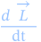         |
| <code>overset</code> <code>stackrel</code> | <code>overset x y</code>                |  |
| <code>root</code>                          | <code>root 3 x</code>                   |          |
| <code>underset</code>                      | <code>underset x y</code>               |  |

A few additional notes:

- For `color`, textual color names, `#rgb`, `#rrggbb` and `#rrggbbaa` strings are
  all supported.
- For `root`, Chrome-based browsers render these VERY poorly when the enclosed
  segment is more than 1 line tall. Firefox gets it right, however.

There are also two special HTML-oriented binary symbols available: `id` and
`class`, which allows you to set the id / class name of a particular element in
the formula.

| Binary HTML Symbols | Example                    | Description                                                               |
| ------------------- | -------------------------- | ------------------------------------------------------------------------- |
| `id`                | `id (special-id) (x^2)`    | Will set the id of the HTML entity that contains 'x^2' to 'special-id'    |
| `class`             | `class (class-name) (x^2)` | Will set the class of the HTML entity that contains 'x^2' to 'class-name' |

### Unicode Lettering Styles

A number of different lettering styles can be applied to strings or terms using
the special "font" unary symbols.

These styles are applied by transforming the characters in the argument into the
'Mathematical Alphanumeric Symbols' Unicode block. All styles support the latin
upper/lowercase letters. Some might additionally support numbers, or the greek
alphabet - it's all up to what is defined within that Unicode block.

| Letter Style Symbols                    | Example                               |
| --------------------------------------- | ------------------------------------- |
| <code>bb</code> <code>mathbf</code>     | 𝐓𝐡𝐞 𝐅𝐢𝐯𝐞 𝐁𝐨𝐱𝐢𝐧𝐠 𝐖𝐢𝐳𝐚𝐫𝐝𝐬 𝐉𝐮𝐦𝐩 𝐐𝐮𝐢𝐜𝐤𝐥𝐲. |
| <code>bbb</code> <code>mathbb</code>    | 𝕋𝕙𝕖 𝔽𝕚𝕧𝕖 𝔹𝕠𝕩𝕚𝕟𝕘 𝕎𝕚𝕫𝕒𝕣𝕕𝕤 𝕁𝕦𝕞𝕡 ℚ𝕦𝕚𝕔𝕜𝕝𝕪. |
| <code>bbcc</code>                       | 𝓣𝓱𝓮 𝓕𝓲𝓿𝓮 𝓑𝓸𝔁𝓲𝓷𝓰 𝓦𝓲𝔃𝓪𝓻𝓭𝓼 𝓙𝓾𝓶𝓹 𝓠𝓾𝓲𝓬𝓴𝓵𝔂. |
| <code>bbfr</code>                       | 𝕿𝖍𝖊 𝕱𝖎𝖛𝖊 𝕭𝖔𝖝𝖎𝖓𝖌 𝖂𝖎𝖟𝖆𝖗𝖉𝖘 𝕵𝖚𝖒𝖕 𝕼𝖚𝖎𝖈𝖐𝖑𝖞. |
| <code>bbit</code>                       | 𝑻𝒉𝒆 𝑭𝒊𝒗𝒆 𝑩𝒐𝒙𝒊𝒏𝒈 𝑾𝒊𝒛𝒂𝒓𝒅𝒔 𝑱𝒖𝒎𝒑 𝑸𝒖𝒊𝒄𝒌𝒍𝒚. |
| <code>bbsf</code>                       | 𝗧𝗵𝗲 𝗙𝗶𝘃𝗲 𝗕𝗼𝘅𝗶𝗻𝗴 𝗪𝗶𝘇𝗮𝗿𝗱𝘀 𝗝𝘂𝗺𝗽 𝗤𝘂𝗶𝗰𝗸𝗹𝘆. |
| <code>bbsfit</code>                     | 𝙏𝙝𝙚 𝙁𝙞𝙫𝙚 𝘽𝙤𝙭𝙞𝙣𝙜 𝙒𝙞𝙯𝙖𝙧𝙙𝙨 𝙅𝙪𝙢𝙥 𝙌𝙪𝙞𝙘𝙠𝙡𝙮. |
| <code>cc</code> <code>mathcal</code>    | 𝒯𝒽ℯ ℱ𝒾𝓋ℯ ℬℴ𝓍𝒾𝓃ℊ 𝒲𝒾𝓏𝒶𝓇𝒹𝓈 𝒥𝓊𝓂𝓅 𝒬𝓊𝒾𝒸𝓀𝓁𝓎. |
| <code>fr</code> <code>mathfrak</code>   | 𝔗𝔥𝔢 𝔉𝔦𝔳𝔢 𝔅𝔬𝔵𝔦𝔫𝔤 𝔚𝔦𝔷𝔞𝔯𝔡𝔰 𝔍𝔲𝔪𝔭 𝔔𝔲𝔦𝔠𝔨𝔩𝔶. |
| <code>italic</code> <code>mathit</code> | 𝑇ℎ𝑒 𝐹𝑖𝑣𝑒 𝐵𝑜𝑥𝑖𝑛𝑔 𝑊𝑖𝑧𝑎𝑟𝑑𝑠 𝐽𝑢𝑚𝑝 𝑄𝑢𝑖𝑐𝑘𝑙𝑦. |
| <code>sf</code> <code>mathsf</code>     | 𝖳𝗁𝖾 𝖥𝗂𝗏𝖾 𝖡𝗈𝗑𝗂𝗇𝗀 𝖶𝗂𝗓𝖺𝗋𝖽𝗌 𝖩𝗎𝗆𝗉 𝖰𝗎𝗂𝖼𝗄𝗅𝗒. |
| <code>sfit</code>                       | 𝘛𝘩𝘦 𝘍𝘪𝘷𝘦 𝘉𝘰𝘹𝘪𝘯𝘨 𝘞𝘪𝘻𝘢𝘳𝘥𝘴 𝘑𝘶𝘮𝘱 𝘘𝘶𝘪𝘤𝘬𝘭𝘺. |
| <code>tt</code> <code>mathtt</code>     | 𝚃𝚑𝚎 𝙵𝚒𝚟𝚎 𝙱𝚘𝚡𝚒𝚗𝚐 𝚆𝚒𝚣𝚊𝚛𝚍𝚜 𝙹𝚞𝚖𝚙 𝚀𝚞𝚒𝚌𝚔𝚕𝚢. |

These styles can either be applied to text (eg: `bb"Text"`), but can also be
applied directly to groups of symbols.

<figure style="text-align: center">
  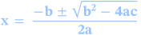
  <figcaption><code>bb (x=(-b+-sqrt(b^2-4ac))/(2a))</code></figcaption>
</figure>

### Spacing Symbols

A few symbols exist to introduce whitespace into the rendered formula.

<figure style="text-align: center">
  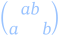
  <figcaption><code>((a b),(a quad b))</code></figcaption>
</figure>

| Spacing Symbols                             | Output                                                |
| ------------------------------------------- | ----------------------------------------------------- |
| <code>&bsol; </code> <code>thinspace</code> | <code>&lt;mspace width=&quot;0.25em&quot;/&gt;</code> |
| <code>enspace</code>                        | <code>&lt;mspace width=&quot;0.5em&quot;/&gt;</code>  |
| <code>quad</code> <code>mspace</code>       | <code>&lt;mspace width=&quot;1em&quot;/&gt;</code>    |
| <code>qquad</code>                          | <code>&lt;mspace width=&quot;2em&quot;/&gt;</code>    |

## Matrixes

Parenthesized lists of lists are treated as Matrixes, and rendered in a grid.
The outer-most braces are stretched to match the height of the full matrix.

<figure style="text-align: center">
  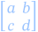
  <figcaption><code>[(a,b), (c,d)]</code></figcaption>
</figure>

Each 'row' in a matrix needs the same number of items it it, so that the number
of columns in the matrix is consistent. However, the cells in the matrix can be
arbitrarily complex.

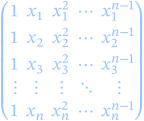

```
( (1,     x_1,   x_1^2, cdots, x_1^{n-1}),
  (1,     x_2,   x_2^2, cdots, x_2^{n-1}),
  (1,     x_3,   x_3^2, cdots, x_3^{n-1}),
  (vdots, vdots, vdots, ddots, vdots    ),
  (1,     x_n,   x_n^2, cdots, x_n^{n-1}) )
```

Augmented matrixes can be drawn by filling a column with `|` symbols.

<figure style="text-align: center">
  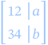
  <figcaption><code>[(1,2,|,a), (3,4,|,b)]</code></figcaption>
</figure>

Note: The main ASCIIMathML project uses the 'columnlines' attribute to draw a
solid line through the augmented matrix. This looks really pretty, but sadly,
Chrome doesn't support that feature, and this leaves the matrix without any
visible separator, which is very confusing. (Honestly, Chrome's MathML support
is pretty lacking, generally.) So this library instead uses an extra-tall
unicode bar character, and tweaks the column spacing to draw the separator
column a little tighter. This doesn't look AS good, but still looks _alright_.
Plus, it'll yield a drawing that is more visually understandable whenever the
browser only supports a _subset_ of MathML.

## Language Grammar

In EBNF, ASCIIMath looks like:

```ebnf
expr := term*;
term := simp ('_' simp)? ('^' simp)? ('/' term)?;
simp := paren | unary | binary | leaf;
paren := ('(' | '[' | ...) expr (')' | ']' | ...);
unary := ('sqrt' | 'floor' | ...) simp;
binary := ('root' | 'frac' | ...) simp simp;
leaf := (str literal) | (num literal) | (symbol) | (char);
```

Where:

- `(str literal)` is a "double quoted string", with internal `""` sequences
  becoming literal `"` characters.
- `(num literal)` is an integer or floating-point string. Leading / trailing
  decimal point characters are allowed. (ie: `123.` and `.123` are both fine.)
- `(symbol)` is one of the many special symbols described in this document.
- `(char)` is a single character, which will be used as a math identifier.

## Differences from main ASCIIMath

- This library defines entries for ALL the greek characters, upper and lower
  case, plus a few extras. There are a few notable gaps in the original spec.
- Text blocks can now contain double-quotes by using the `""` symbol.
  (ie: `"hello ""world"""` -> `hello "world"`)
- Matrixes have a slightly more forgiving syntax: The final bracket can be
  omitted, and the final row can have fewer entries, to make incremental renders
  while typing succeed more often.
- This library also handles unicode characters more gracefully. The original
  library's parser worked in a way that could break surrogate pairs if
  encountered. This would result in diagrams with broken unicode in them. This
  library will always pick single characters from the text based on their
  unicode encoding, so larger unicode sequences (such as emojis) will still
  render correctly.
